Pronitor
==============================
**Pronitor** is a desktop application based on the .NET framework. Pronitor's main functionality is to monitor windows processes, 
and kills corresponding tasks when a predefined timer threshold is reached.

The application also allows to manually kill a specific task. Also, it can listen to tasks that are currently not active.

With a simple user interface, users have the ability to see, observe, and kill any added processes, even if they had multiple instances.

Components
------------
**Pronitor** contains the following modules:
* A console application 
* UI based on .NET windows forms
  * Check log
  * Kill one or all tasks
  * Delete one or all monitors
  * Sort monitors based on multiple options
  * Add multiple monitors
    * Choosing from currently active processes or typing desired process name
* Manager class which contains the main application's logic    
* Simple logging interface
* NUnit tests

Usage
------------

When launching the app through the terminal, the application connects the user directly to Router.cs, which decides if the user gets redirected to UI, 
Console, or just throw an exception in case input was validated wrong.

Entering the following line for example in the terminal will cause the launching of the console with the passed variables of ("Taskmgr" as for process name, "3" for three minutes lifeTime, and "1" for one minute frequency):
```
Pronitor.exe Taskmgr 3 1
```

Further on in this section, you will see the main functionalities of the application with a simple explanation:

### Console
**Pronitor** Console will append only one monitor which will show any changes on the tasks under the name of the monitor

Under, we will demonstrate the basics use of the console:
> As a follow-up to the terminal launch we did in Usage (`Pronitor.exe Taskmgr 3 1`), a dialogue will appear asking the user 
> to determine the killKey variable as follows:
> 
>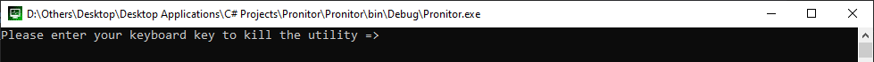
>
>Figure 1.1

**Warning**: If the killKey was set to `Tab` (which is the default key to switch to UI), The UI switch key will be instead changed to 
`Enter`.

> After the killKey variable has been passed, monitoring will start immediately informing the user about any changes that might occur
> in the processes in windows.
> 
>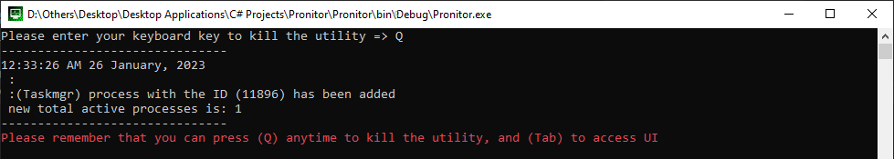
>
>Figure 1.2

> In this figure the user decided to launch a UI instance, hence the console will be informing him about his action and will launch MainMenu's form
> 
>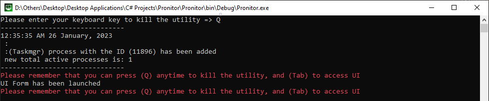
>
>Figure 1.3

> After a while, the application detected that the processes no longer exist in windows, so the program keeps the monitoring alive in case new processes appear
> and kills the stored old task 
> 
>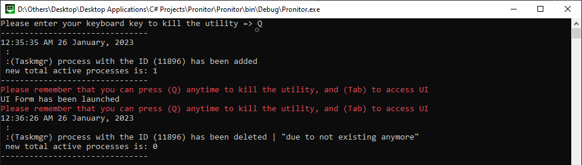
>
>Figure 1.4

**Note**: Keep in mind, that the user can kill the monitor or enter the UI at any time by pressing the assigned variables the user declared.

### UI
**Pronitor** UI will show multiple real-time monitors that are currently running, each will contain a number referring to how many 
tasks or processes in windows are currently running.

In the following steps, you will see the process of adding a new monitor:

> This will be the MainMenu, in which the user has to press the `Add Monitor` button located on the left of the datagridview.
> 
>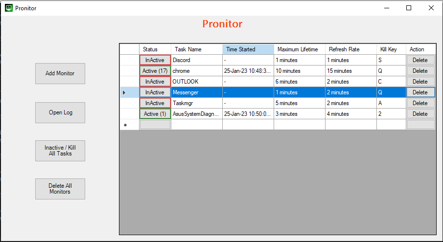
>
>Figure 2.1

> After clicking on the `Add Monitor` button, the Add monitor form will appear, in which we have to fill in some credentials
> 
>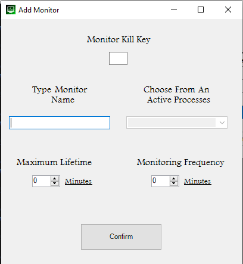
>
>Figure 2.2

> This figure shows the option to choose a process from the active lists currently in windows
> 
>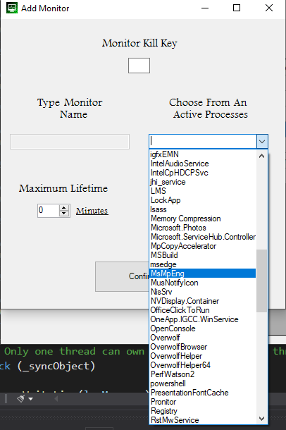
>
>Figure 2.3

> Press confirm to validate to pass all the inputs
> 
>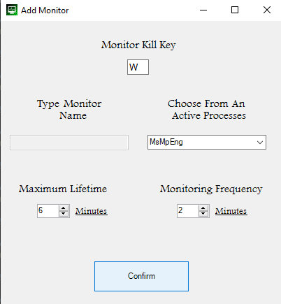
>
>Figure 2.4

> Finally, the monitor should be appended to the table as follows:
> 
>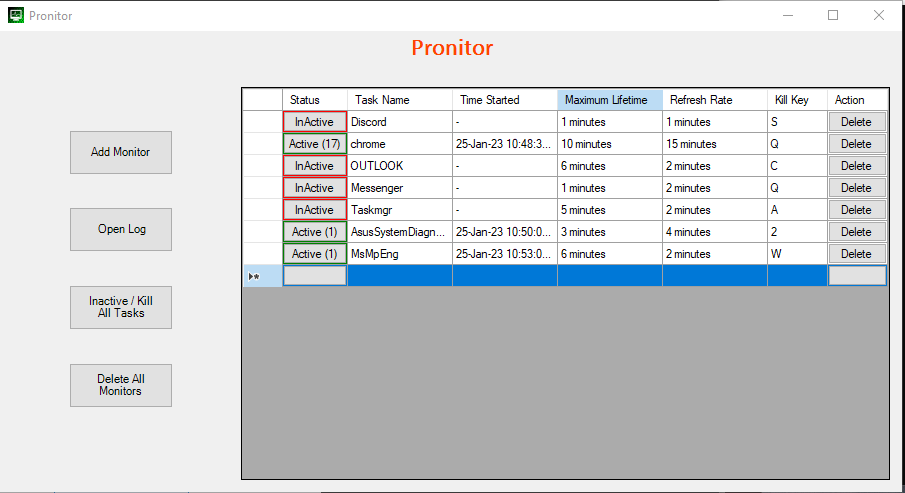
>
>Figure 2.5


>**Note**: Any invalid input will give one of those alert windows:
>
>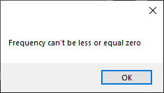
>
>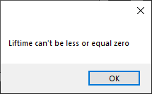
>
>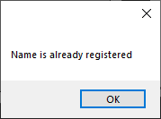
>
>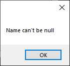
>
>Figures 2.6.1 - 2.6.4


### LogFile

Any changes to data whether it's deleted or in addition to tasks will be written into the log.
Here is an example of two monitors(OUTLOOK, chrome) operating together:

```
-------------------------------
10:38:50 PM 25 January, 2023
 :
 :(OUTLOOK) process with the ID (3440) has been added 
 new total active processes are: 1
-------------------------------
10:38:50 PM 25 January, 2023
 :
 :(chrome) process with the ID (23540) has been added 
 new total active processes are: 3
-------------------------------
10:38:50 PM 25 January, 2023
 :
 :(chrome) process with the ID (13296) has been added 
 new total active processes are: 4
-------------------------------
10:39:16 PM 25 January, 2023
 :
 :(chrome) process with the ID (13296) has been deleted | "due to user instruction" 
 new total active processes are: 3
-------------------------------
10:39:17 PM 25 January, 2023
 :
 :(chrome) process with the ID (16488) has been deleted | "due to not existing anymore" 
 new total active processes are: 2
-------------------------------
10:39:50 PM 25 January, 2023
 :
 :(OUTLOOK) process with the ID (12692) has been deleted | "due to timeout" 
 new total active processes are: 0
-------------------------------
```

Threads
------------
**Pronitor** uses a lot of timer events, which means that the application runs on a multithreaded and multiprocessing schema, the timers used will be as follows:
* In UI MainMenu to refresh the displayed grid table | each half a second
* Timer for Monitor to scan for any changes happening in the background from windows (detects no longer active processes, detects new processes in windows) | each three seconds
* For each task in Monitor, we will check if the task has exceeded the lifeTime specified by the user | each minute declared by the user

Below is an example of an active thread in a situation where there is: a UI window open, and two monitors are running, each containing two tasks.

>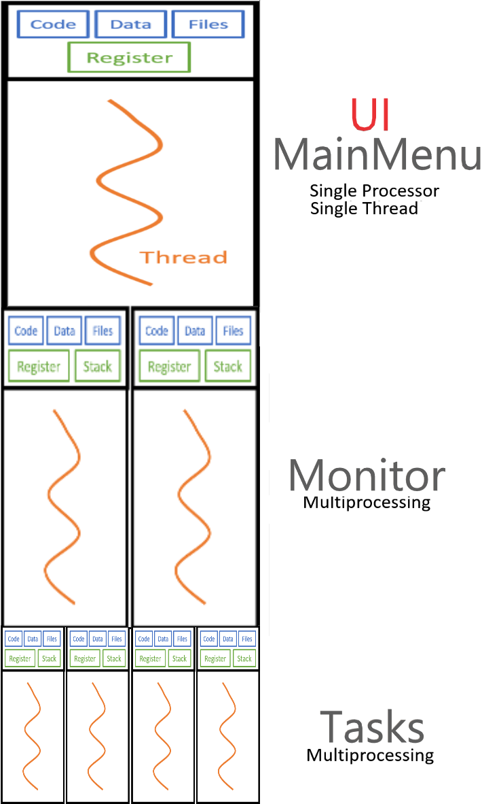
>
>Figure 3.1 | [Source](https://towardsdatascience.com/multithreading-and-multiprocessing-in-10-minutes-20d9b3c6a867#7fda)

Validation
------------
**Pronitor** expects three main inputs, which are:
* Process name
* Process LifeTime
* Process Frequency

Please notice the following block of code, which will validate each of the inputs:

``` c#
public static bool Validator(string name, int lifetime, int frequency)
{
    if (!IsNameUnique(name))
        throw new ArgumentException(name + "already exists!");
    if (frequency <= 0)
    {
        throw new ArgumentException("frequency can't be less that or equal zero!");
    }
    if (lifeTime <= 0)
    {
        throw new ArgumentException("lifeTime can't be less that or equal zero!");
    }
    return true;
}
```
As noticed, the code assures the uniqueness of all monitor names, and the other attributes to be numbers and above zero


> **Warning**: Since we pass the arguments as integer numbers (not as ControlKeys), if the user chooses a `Numeric Keypad` as a killKey. 
> The num-pad keys have different scancodes, which means the user has to press the corresponding `number key` rather than the number 
> in `keypad`


Notes
------------

* The Following Tag has been specified to grant administrative privileges before launching the application:
``` xml
<requestedExecutionLevel level="requireAdministrator" uiAccess="false" />
```
* Elevated privileges are required for the following reasons:
  * List running processes 
  * Killing tasks
  * Accessing log files when write permissions are limited

**Warning**: NUnit tests do not cover integration or end-to-end tests in the current release.

--------